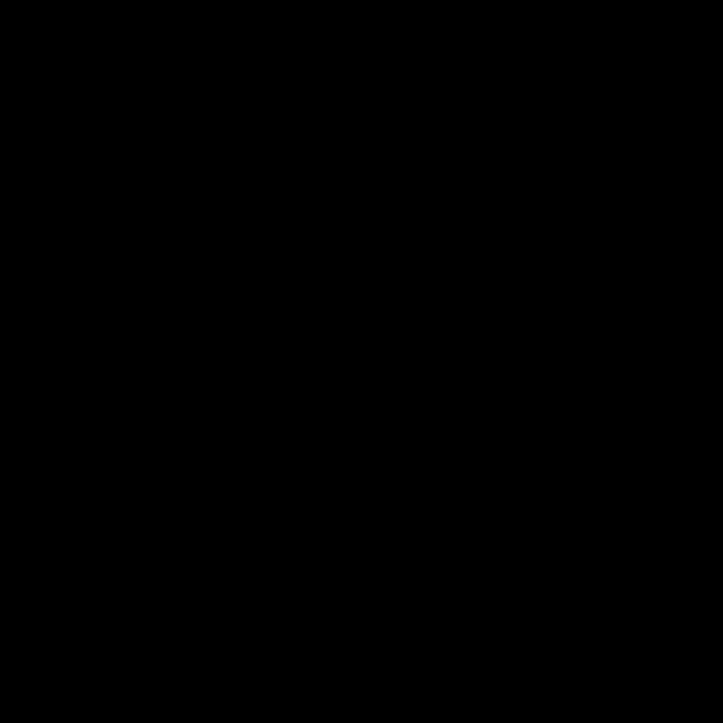

# 🟦 Sierpiński Carpet Animation Generator
A visually stunning and customisable animation generator for the Sierpiński carpet fractal, built with Python. Create mesmerising fractal animations as MP4 or GIF, with both a user-friendly GUI and a powerful CLI.

## ✨ Features
- 🌀 Generates high-resolution Sierpiński carpet fractal animations
- 🎬 Export as MP4 (requires ffmpeg) or GIF (requires Pillow)
- 🖥️ Modern, intuitive GUI (PySide6/Qt) and simple CLI
- ⚡ Live preview, progress bar, and phase updates in GUI
- 🛠️ Customisable: recursion depth, animation speed, size, and more
- 📦 MIT licensed and open source
- 📚 Well-documented with examples and usage instructions

## 🖼️ Example


## 🚀 Quick Start
### 1. Install Requirements
This project requires Python 3.7+ and the following packages:
- numpy
- matplotlib
- PySide6 (for GUI)

Install them with pip:
```sh
pip install numpy matplotlib PySide6
```
For MP4 export, you also need [ffmpeg](https://ffmpeg.org/) installed and accessible in your PATH.

For GIF export, you also need Pillow:
```sh
pip install Pillow
```

### 2a. Run the GUI
```sh
python main_gui.py
```

### 2b. Run from the Command Line
```sh
python main_cli.py
```

## 🧑‍💻 Usage
### GUI
- Set the recursion depth, carpet size (must be a power of 3), frames per order, FPS, and output file name.
- Choose output format: MP4 or GIF.
- Click "Create animation" and watch the live preview and progress bar.

### CLI
Edit the parameters at the bottom of `main_cli.py` to customise the animation, then run:
```sh
python main_cli.py
```

## 📝 Licence
MIT — free for personal and commercial use. See the [LICENSE](./LICENSE) file for details.

---
Made with ❤️ by [@overstimulation](https://github.com/overstimulation)
